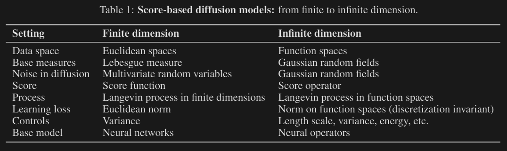
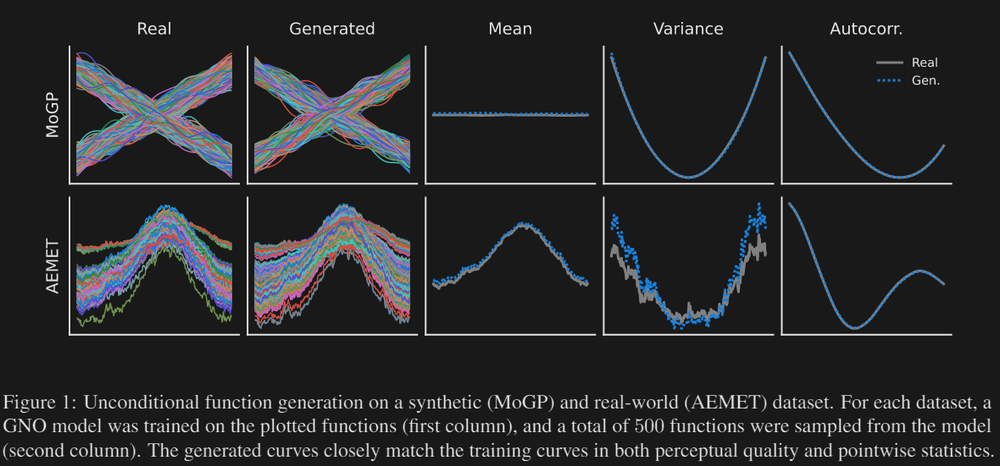
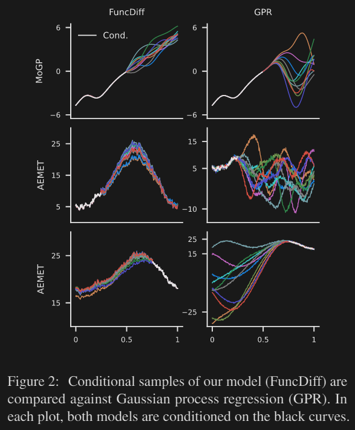
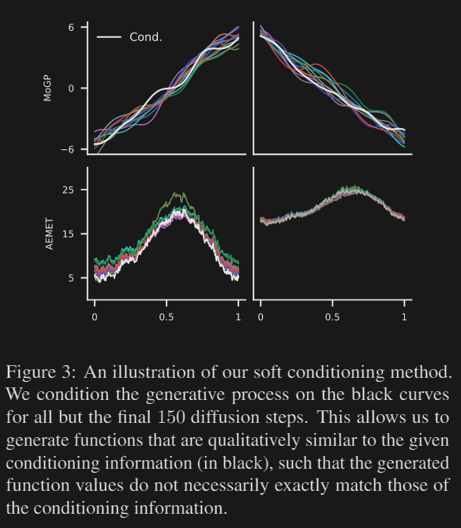
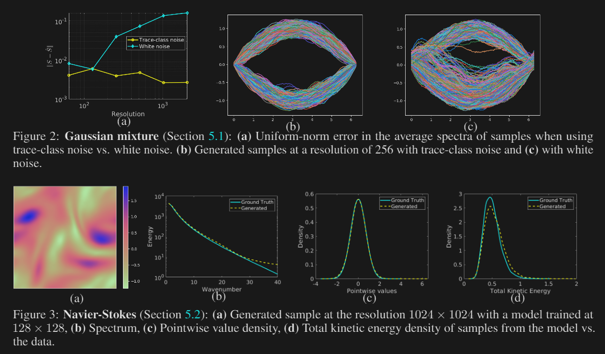
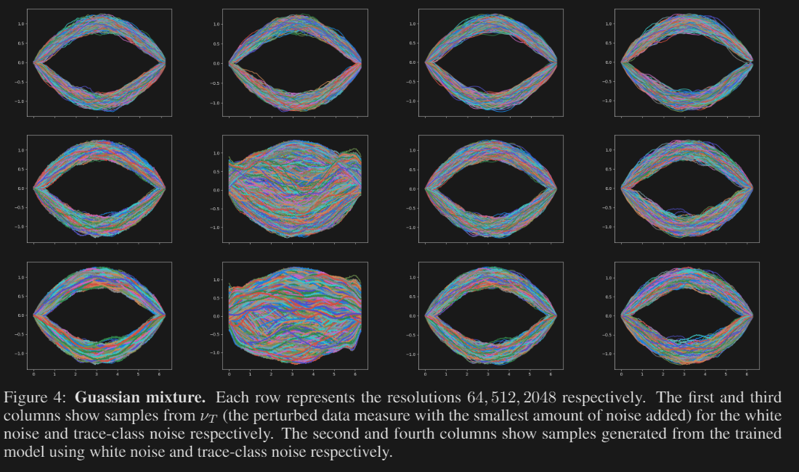

# Title
1. Diffusion Generative Models in Infinite Dimensions
2. Score-based Diffusion Model in Function Space

# Authors and Year
1. Gavin Kerrigan, Justin Ley, Padhraic Smyth (2023)
2. Jae Hyun Lim, Nikola B. Kovachki et al (2023)

# Abstract
1. Diffusion generative models have recently been applied to domains where the available data can be seen as a discretization of an underlying function, such as audio signals or time series. However, these models operate directly on the discretized data, and there are no semantics in the modeling process that relate the observed data to the underlying functional forms. We generalize diffusion models to operate directly in function space by developing the foundational theory for such models in terms of Gaussian measures on Hilbert spaces. A significant benefit of our function space point of view is that it allows us to explicitly specify the space of functions we are working in, leading us to develop methods for diffusion generative modeling in Sobolev spaces. Our approach allows us to perform both unconditional and conditional generation of functionvalued data. We demonstrate our methods on several synthetic and real-world benchmarks.

2. Diffusion models have recently emerged as a powerful framework for generative modeling. They consist of a forward process that perturbs input data with Gaussian white noise and a reverse process that learns a score function to generate samples by denoising. Despite their tremendous success, they are mostly formulated on finite-dimensional spaces, e.g. Euclidean, limiting their applications to many domains where the data has a functional form such as in scientific computing and 3D geometric data analysis. In this work, we introduce a mathematically rigorous framework called Denoising Diffusion Operators (DDOs) for training diffusion models in function space. In DDOs, the forward process perturbs input functions gradually using a Gaussian process. The generative process is formulated by integrating a function-valued Langevin dynamic. Our approach requires an appropriate notion of the score for the perturbed data distribution, which we obtain by generalizing denoising score matching to function spaces that can be infinite-dimensional. We show that the corresponding discretized algorithm generates accurate samples at a fixed cost that is independent of the data resolution. We theoretically and numerically verify the applicability of our approach on a set of problems, including generating solutions to the Navier-Stokes equation viewed as the push-forward distribution of forcings from a Gaussian Random Field (GRF)

# Model Type
Score-based Diffusion model

# Motivation
지금까지의 Diffusion model은 예컨대 그림, 단백질 구조, 결합 구조 등의 `연속 변수의 유한 차원 벡터`를 생성하는 모델이었다.
그렇기에 시계열 데이터와 같이 함수형으로 주어지는 데이터 형태는 생성할 수 없었다. 
\begin{equation}
    X_t: \mathbb{R} \rightarrow \mathbb{R}
\end{equation}

이 모델에서는 무한차원 벡터 내지는 함수형 데이터를 생성하는 Diffusion model을 만들기 위해 함수에 `Gaussian kernel`을 가하는 방식을 고려하였다. 

# Related Works
1. 차원이 늘어남에 따라 Model complexity가 증가하는 문제를 해결하는 방법
     - Latent space에서의 diffusion을 고려함.[^1]
     - Hierachically defined subspaces[^2]
     - Spectral decompositions[^3]
     - 아직 무한차원이 아니라 finite
2. 무한 차원 데이터와 관련한 딥러닝
     - Neural process: Neural network + Gaussian process[^4]
     - Neural Diffusion process[^5]
     - Resolution을 높일수록 성능이 떨어지는 기존의 문제를 그대로 답습함
     - Function space 내에 closed되지 않은 연산

[^1]: Arash Vahdat, Karsten Kreis, and Jan Kautz. Score-based generative modeling in latent space. In Neural Information Processing Systems (NeurIPS), 2021

[^2]: Bowen Jing, Gabriele Corso, Renato Berlinghieri, and Tommi Jaakkola. Subspace diffusion generative models. arXiv preprint arXiv:2205.01490, 2022.

[^3]: Angus Phillips, Thomas Seror, Michael Hutchinson, Valentin De Bortoli, Arnaud Doucet, and Emile Mathieu. Spectral diffusion processes. arXiv preprint arXiv:2209.14125, 2022

[^4]: Marta Garnelo, Jonathan Schwarz, Dan Rosenbaum, Fabio Viola, Danilo J Rezende, SM Eslami, and Yee Whye Teh. Neural processes. arXiv preprint arXiv:1807.01622, 2018.
 
[^5]: Vincent Dutordoir, Alan Saul, Zoubin Ghahramani, and Fergus Simpson. Neural diffusion processes. arXiv preprint arXiv:2206.03992, 2022

어떻게 Density를 정의했지?
Density gradient를 어떻게 학습했지?
Noise를 어떻게 주지?
어떻게 Inference 하지?

# Main work summary
## Diffusion Generative Models in Infinite Dimensions
Function space에서의 Denoising diffusion model.

Conditional generation.[^6]

[^6]: Jooyoung Choi, Sungwon Kim, Yonghyun Jeong, Youngjune Gwon, and Sungroh Yoon. ILVR: Conditioning method for denoising diffusion probabilistic models. In 2021 IEEE/CVF International Conference on Computer Vision (ICCV), pages 14347–14356, 2021

## Score-based Diffusion Model in Function Space
White-noise process로 noise를 주는 경우 효과가 좋지 않아 Trace-class noise라는 새로운 noise를 사용함. 

    

# Structure of model: Way to define density
1. Function space $(H, \braket{\cdot, \cdot}, \norm{\cdot})$: Infinite-dimensional, real, separable Hilbert space
2. Measure $\mathcal{B}(H)$: Borel $\sigma-$algebra
3. Data measure $\mu \in \mathcal{B}(H)$
4. Dataset $\qty{u_j}_{i=1}^N$: Sample satisfying $u_j \sim \mu$, Inifinite dimensional objects
5. centered Gaussian measure $\mu_0 = N(0, C)$ with covariance operator assumed to be self-adjoint, non-negative, trace-class.

Trace-class란 것은 Covariance operator의 trace가 finite하단 것을 의미하는데, 따라서 identity covariance $I$는 trace-class하지 않다. 

6. Cameron-Martin space assumption

\begin{equation}
    \mu(H_{\mu_0}) = 1 \textrm{\quad where \quad} 
    H_{\mu_0} = C^{1/2}(H)
\end{equation}

Inference 과정의 perturbation을 하기 위해서는 `manifold hypothesis`를 만족해야하는데, random process에서는 위와 같이 표현됨. 

# Training: Way to train density gradient
Derivative in measure: Radon-Nikodyn derivative

# Inference: How to apply noise to data

# Results
Input process와 Generated prcocess들

## Diffusion Generative Models in Infinite Dimensions

    

    

    

## Score-based Diffusion Model in Function Space

    

    

