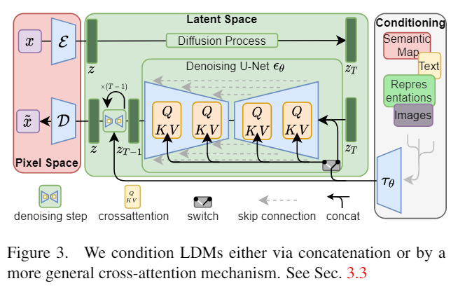

# Title
[High-Resolution Image Synthesis with Latent Diffusion Models]("https://arxiv.org/abs/2112.10752")

# Authors and Year
Robin Rombach, Andreas Blattmann, Dominik Lorenz, Patrick Esser, Bjorn Ommer (2022)

# Abstract
By decomposing the image formation process into a sequential application of denoising autoencoders, diffusion models (DMs) achieve state-of-the-art synthesis results on image data and beyond. Additionally, their formulation allows for a guiding mechanism to control the image generation process without retraining. However, since these models typically operate directly in pixel space, optimization of powerful DMs often consumes hundreds of GPU days and inference is expensive due to sequential evaluations. To enable DM training on limited computational resources while retaining their quality and flexibility, we apply them in the latent space of powerful pretrained autoencoders. In contrast to previous work, training diffusion models on such a representation allows for the first time to reach a near-optimal point between complexity reduction and detail preservation, greatly boosting visual fidelity. By introducing cross-attention layers into the model architecture, we turn diffusion models into powerful and flexible generators for general conditioning inputs such as text or bounding boxes and high-resolution synthesis becomes possible in a convolutional manner. Our latent diffusion models (LDMs) achieve new state-of-the-art scores for image inpainting and class-conditional image synthesis and highly competitive performance on various tasks, including text-to-image synthesis, unconditional image generation and super-resolution, while significantly reducing computational requirements compared to pixel-based DMs.

# Model Type
Denoising diffusion model with cross-attention layer / auto-encoder

# Motivation 
기존의 Denoising diffusion model은 `pixel space`에서의 diffusion을 simulation했기 때문에 계산 비용이 매우 컸다. 
하지만 Image space는 whole pixel space보다 매우 작은 차원을 가지는 공간이 될 것이므로 Featurization을 거친 후, feature 단에서의 diffusion을 고려하면 훨씬 적은 계산비용으로 image 생산이 가능할 것이라 생각했다. 

# Main work summary
1. Work on a compression level
2. Achieve competitive performance on multiple tasks (unconditional image synthesis, inpainting, stochastic super-resolution)
3. Encoder/Decoder에 대한 delicate weighting이 필요없는 방법
4. 1024 x 1024 스케일의 사진 생성이 가능해짐
5. General-purpose conditioning mechanism based on cross-attention

    

Cross-attention에 condition을 태우기 전에, Bert tokenizer 등을 이용해 condition을 embedding. 

# Result
- 논문 그림 참고.