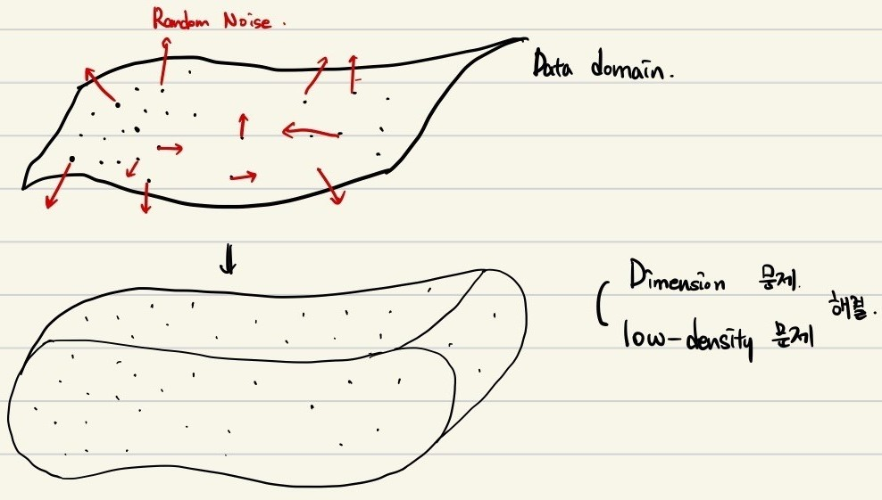
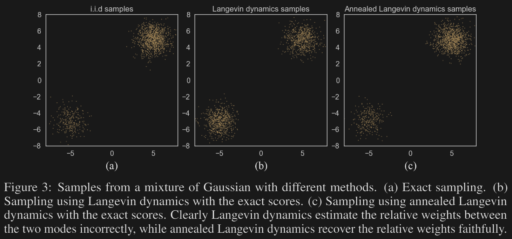

## Paper information
Yang Song, and Stefano Ermon, 
"Generative Modeling by Estimating Gradients of the Data Distribution",
[NeurIPS **32** (2019)](https://arxiv.org/abs/1907.05600)

## Abstract
We introduce a new generative model where samples are produced via Langevin dynamics using gradients of the data distribution estimated with score matching. Because gradients can be ill-defined and hard to estimate when the data resides on low-dimensional manifolds, we perturb the data with different levels of Gaussian noise, and jointly estimate the corresponding scores, i.e., the vector fields of gradients of the perturbed data distribution for all noise levels. For sampling, we propose an annealed Langevin dynamics where we use gradients corresponding to gradually decreasing noise levels as the sampling process gets closer to the data manifold. Our framework allows flexible model architectures, requires no sampling during training or the use of adversarial methods, and provides a learning objective that can be used for principled model comparisons. Our models produce samples comparable to GANs on MNIST, CelebA and CIFAR-10 datasets, achieving a new state-of-the-art inception score of 8.87 on CIFAR-10. Additionally, we demonstrate that our models learn effective representations via image inpainting experiments.

## Limitation of precedent research
Likelihood-based methods의 한계점
- 문제마다 특징적인 구조를 사용해야만 함
- Surrogate loss를 사용해야 함
  
Generative adversarial networks
- 학습이 불안정해 끝나지 않을 수 있음
- 다른 모델과의 직접 비교가 쉽지 않음

그래서 data point에서의 log-density의 gradient를 학습하는 방법론을 제시하려 한다.
이 gradient는 이후 sample generation 단계에서 sample이 most-probable한 지점으로 이동하도록 하는 단서가 된다. 

## Main challenges and Tackles
Probability density를 학습하는 방법에는 크게 두 가지 문제가 있다.
- Data distribution은 가능한 공간에 비해 매우 제한적이고, low-dimensional할 것이다. 이 경우 gradient가 정의되지 않는 영역이 매우 많아 이 영역에서 시작하는 sample 생성이 이뤄질 수 없다. 
- Training dataset은 그보다 더 제한적일 것이다. 이는 gradient의 정확성을 떨어뜨리고, 높지 않은 density 영역을 돌아다니게 만들어 sample 생성과정을 느리게 만들 것이다. 

이러한 문제를 해결하기 위해 데이터에 **Gaussian noise**를 추가하는 방식을 제안한다. 
noise는 더이상 low-dimensional 하지 않을 것이기 때문에, noise가 가해진 data domain은 아래 그림과 같이 전 영역으로 넓게 퍼질 수 있게 된다. 

아래 그림을 보면 random noise가 없이 학습한 경우 학습이 거의 진행되지 않고 loss가 오르내리는 것을 볼 수 있지만,
random noise를 추가한 경우엔 순조롭게 학습이 진행되는 것을 확인할 수 있다. 

random noise는 low-density 영역으로 데이터를 옮겨가게 만듦으로써, gradient를 만들어내는 역할을 할 수 있다. 

하지만 random noise가 너무 크면 입자들의 최종 분포가 원하는 데이터 분포와 달라질 수 있으므로, 
noise level을 변화시키면서 gradient를 학습시켰다. (하지만 single score network임)
처음엔 강한 noise에서 sample이 움직여 low-density 영역을 탈출할 수 있도록 하고, 점차 약한 noise로 바꾸어 원하는 데이터 분포를 따르도록 유도하는 방식을 쓸 수 있다. 
(이는 simulated annealing[^1][^2]에서 영감을 받았다.)

이런 현상은 아래 그림에서 확인할 수 있다. 
가중치가 다른 두 분포가 섞여있을 때, 이 합성 분포의 gradient를 그대로 이용해 움직이는 입자는 low-density 영역을 넘어가지 못해 가중치를 적절히 반영하지 못합니다. 
하지만 annealed Langevin dynamics를 적용한 경우에는 원래 sample을 그대로 복원한 것을 볼 수 있습니다. 

[^1]: S.Kirkpatric et al. "Optimiation by simulated annealing". *Science* (1983)
[^2]: R.M. Neal. "Annealed importance sampling". *Statistics and computing*. (2001)

## Properties
- Tractable
- Optimized without adversarial training, MCMC sampling etc.  
- Available to quantitatively comapare different models by using efficacy. 

## Networks
### Noise conditional score networks
위치와 noise level을 같이 input 했을 때의 distribution gradient를 학습하는 network

특징적인 network 구조는 사용하지 않음.
Image generation을 예시로 들었을 때, image의 pixel 정보를 모두 받아 같은 차원의 gradient vector를 만들기 때문에 이는 semantic segmentation과 그 구조가 같음.  
해당 분야에서 유명한 U-Net [^3]과 dilated/atrous convolution [^4]

[^3]: O.Ronneberger et al. "U-Net: Convolutional networks for biomedical image segmentation". *MICCAI*, (2015)
[^4]: F. Yu et al. "Multi-scale context aggregation by dilated convolutions". *ICLR*. (2016)

(Semantic Segmentation 예시)

Instance normalization [^5]

[^5]: D. Ulyanov et al. "Instance normalization: The missing ingredient for fast stylization". arXiv (2016)

## Langevin dynamics
### Introduction to Langevin dynamics

Langevin dynamics는 `무작위적인 힘`이 가해지는 입자의 운동을 지칭합니다. 
이 무작위적인 힘은 다양한 원천이 있습니다. 
유체 속에 있는 입자의 경우에는 유체 분자의 무작위적 충돌의 총합이,
사람의 의사결정의 변화를 따질 때에는 외부에서 제공되는 여러 정보들을 무작위적 충격(kick)으로 봅니다. 

Newtonian dynamics에서 Newton 방정식이 있듯이, Langevin dynamics에도 Langevin 방정식이 있습니다.
\begin{equation}
  m \dv{v}{t} = - \gamma v + F + \xi(t)
\end{equation}
물체의 가속도가 총 세 개의 힘에 의해 결정된다는 방정식인데, 
첫번째부터 순서대로 유체로부터 받는 저항력, 외부로부터 받는 힘, 유체로부터 받은 무작위적 충격을 나타냅니다.
이러한 방정식을 underdamped Langevin equation이라 합니다. 
여기서 유체로부터 받는 저항력에 의하여 물체의 속도는 특정 속도로 수렴하는 경향성을 가집니다. 

이때 저항력이 매우 세서 물체의 속도가 매우 빠른 시간안에 수렴해버리는 경우를 우리는 overdamped system이라 합니다.
그때의 Langevin dynamics를 두고 overdamped Langevin dynamics라 하죠.
\begin{equation}
  v = \dv{x}{t} = \frac{1}{\gamma} F + \frac{\xi(t)}{\gamma}
\end{equation}

이를 매우 짧은 시간간격 $\dd t$에 대해 적분하면 짧은 시간 동안의 물체의 변위를 구할 수 있습니다.
\begin{equation}
  x(t + \dd t) = x(t) + \frac{1}{\gamma} F \dd t + \sqrt{2 D \dd t} z
\end{equation}
여기서 $z$는 normalized Gaussian noise이고, $D$는 입자의 확산계수라고 불리는 물리량입니다. 
무작위적 충격 $\xi$의 시간 적분이 왜 Gaussian noise의 형태로 나타나고, 확산 계수 $D$가 어떤 의미를 가지는지는 
각각 `Central limit theorem`과 `Fluctuation-Dissipation theorem`을 이용해 설명할 수 있습니다. 

### Constant signal-to-noise ratio

## 다른 모델과의 차이점
GANs - adversarial network가 필요함

Sohl. Dickstein은 Noisy distribution에서 data distribution을 복원하는 kernel as Markov chain을 학습하는 방식.
data distribution에서 random noise 가는 과정을 학습할 때 매우 조금씩 변화시켜야 하며, 그로 인해 수천번의 학습이 필요함. 

이 논문에서는 noisy picture에서 Random motion을 거쳐 data distribution 위의 한 점으로 이동하게 하는 method를 학습한 것. 
adversarial network도 필요 없음. 

## Results

